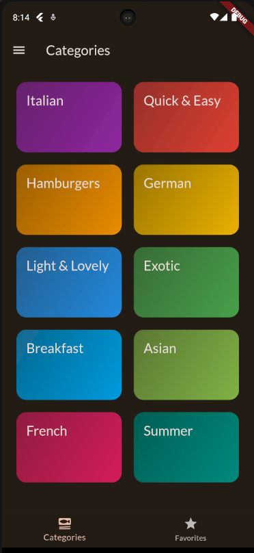

# Meals App

Welcome to the Meals App, a Flutter project that showcases state management, screen navigation, and animations for managing and discovering delicious meals.





## Table of Contents
- [Features](#features)
- [Installation](#installation)
- [Usage](#usage)
- [Folder Structure](#folder-structure)
- [State Management](#state-management)
- [Navigation](#navigation)
- [Animations](#animations)
- [Contributing](#contributing)
- [License](#license)

## Features

- Browse a collection of mouthwatering meals.
- Filter meals by category, ingredients, and more.
- View detailed information about each meal.
- Easily manage and organize your favorite meals.
- Smooth animations for a delightful user experience.

## Installation

To run the Meals App on your local machine, follow these steps:

1. Clone the repository:

   ```bash
   git clone https://github.com/yourusername/meals-app.git

